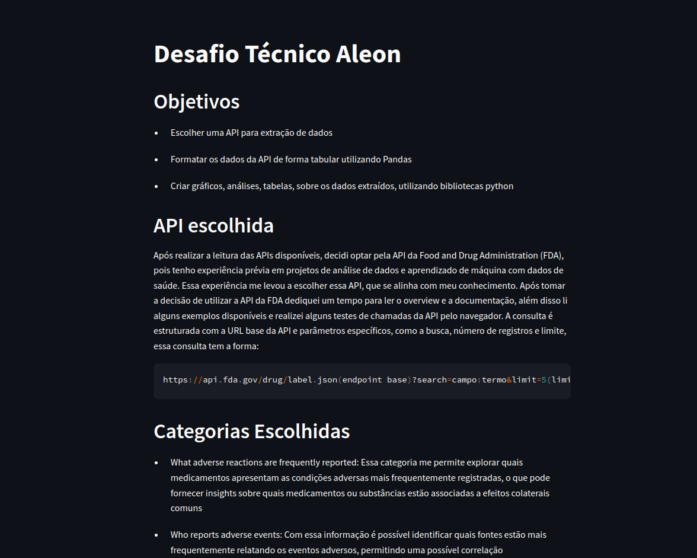
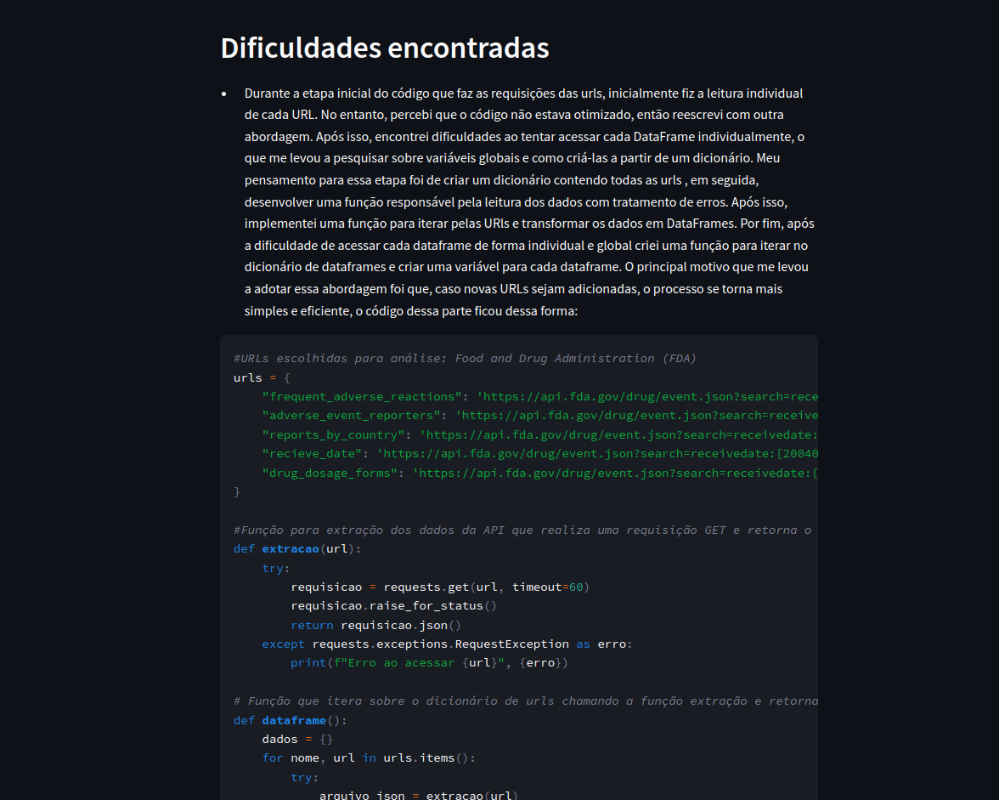
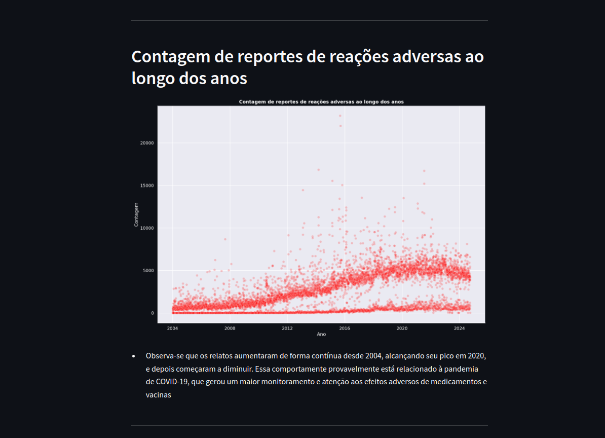

# Desafio Técnico Aleon

O desafio tem como objetivo extração de dados atráves de uma API, formatar os dados em formato tabular com a utilização do Pandas e por fim criar gráficos, análises, tabelas, sobre os dados extraídos.

## Dependências e execução: 

### Clone o repositório
```bash 
git clone https://github.com/guipereira2/DesafioAleon
cd DesafioAleon
```
### As dependências são: 

- Requests
- Pandas
- Matplotlib
- Seaborn
- Streamlit

Certifique-se de ter um ambiente Python configurado para as dependências.

### Utilizando Conda 
```bash
conda install --file requirements.txt
```
### Utilizando o pip  
```bash
pip install -r requirements.txt
```

### Execute o arquivo .py 
```bash
python main.py
```

### Execute o dashboard
```bash
streamlit run storytelling.py
```

## Sobre 

Esse projeto foi desenvolvido com a API da Food and Drug Administration(FDA) com o objetivo de fazer análise de dados de saúde explorando a relação entre medicamentos, relações adversas e outros fatores. 
O projeto inclui: 

- Extração dos dados da API pública da FDA
- Tratamento de erros e boas práticas de programação
- Conversão dos dados para formato tabular em Pandas
- Tratamento e manipulações com os DataFrames
- Criação de diversos gráficos como em barra, dispersão e setores
- Análise dos gráficos e dados obtidos
- Dashboard para storytelling incluindo contextualização, problemas e soluções

## Prints do dashboard
### Primeira imagem
##

### Segunda imagem
##

### Terceira imagem
##
 

